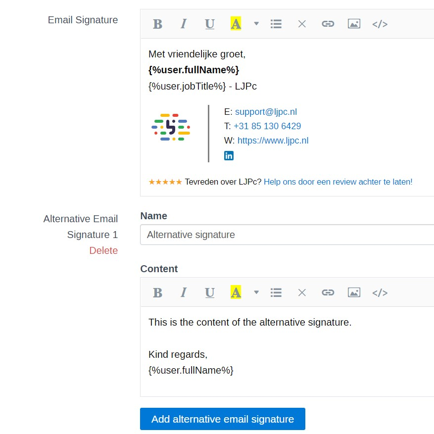
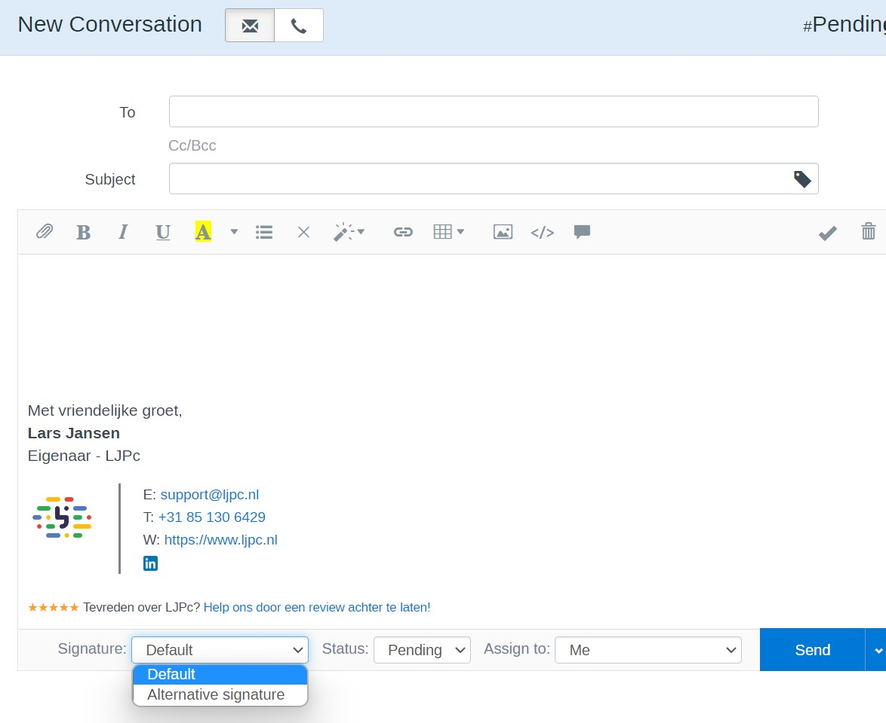
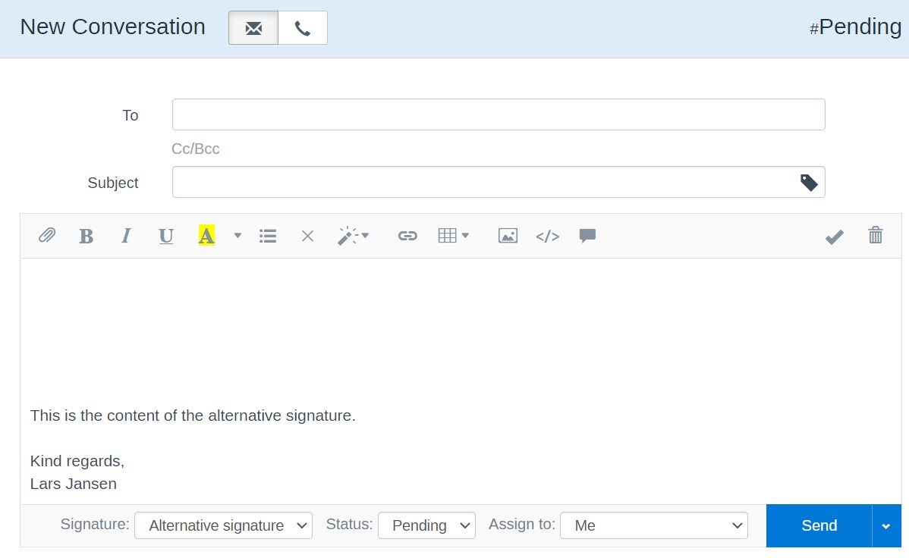

# LJPc alternative signature module for FreeScout

This module adds the option to add alternative signatures in FreeScout.

## Functions

- You can add unlimited signatures per mailbox.
- Every text is translatable.
- You can select the desired signature per conversation.
- The selected signature is remembered per conversation.
- Variables are supported

## Installation

1. Download the latest module zip file via the releases card on the right.
2. Transfer the zip file to the server in the Modules folder of FreeScout.
3. Unpack the zip file.
4. Remove the zip file.
5. Activate the module via the Modules page in FreeScout.
6. Add at least one signature via the mailbox settings in FreeScout.

## Update instructions

1. Download the latest module zip file via the releases card on the right.
2. Transfer the zip file to the server in the Modules folder of FreeScout.
3. Remove the folder LJPcAlternativeSignatureModule
4. Unpack the zip file.
5. Remove the zip file.
6. Activate the module via the Modules page in FreeScout.

## Contributing

Feel free to add your own features by sending a pull request.

## Custom software

Interested in a custom FreeScout module or anything else? Please let us know
via [info@ljpc.nl](mailto:info@ljpc.nl?subject=Signatures%20module) or [www.ljpc.solutions](https://ljpc.solutions).

## Donations

This module took us a lot of time, but we decided to make it open source anyway. If we helped you or your business,
please consider donating.
[Click here](https://www.buymeacoffee.com/Lars-) to donate.

## Screenshots
Setup the alternative signatures:

---
Select the desired signature when composing a new message:

---
Result:

